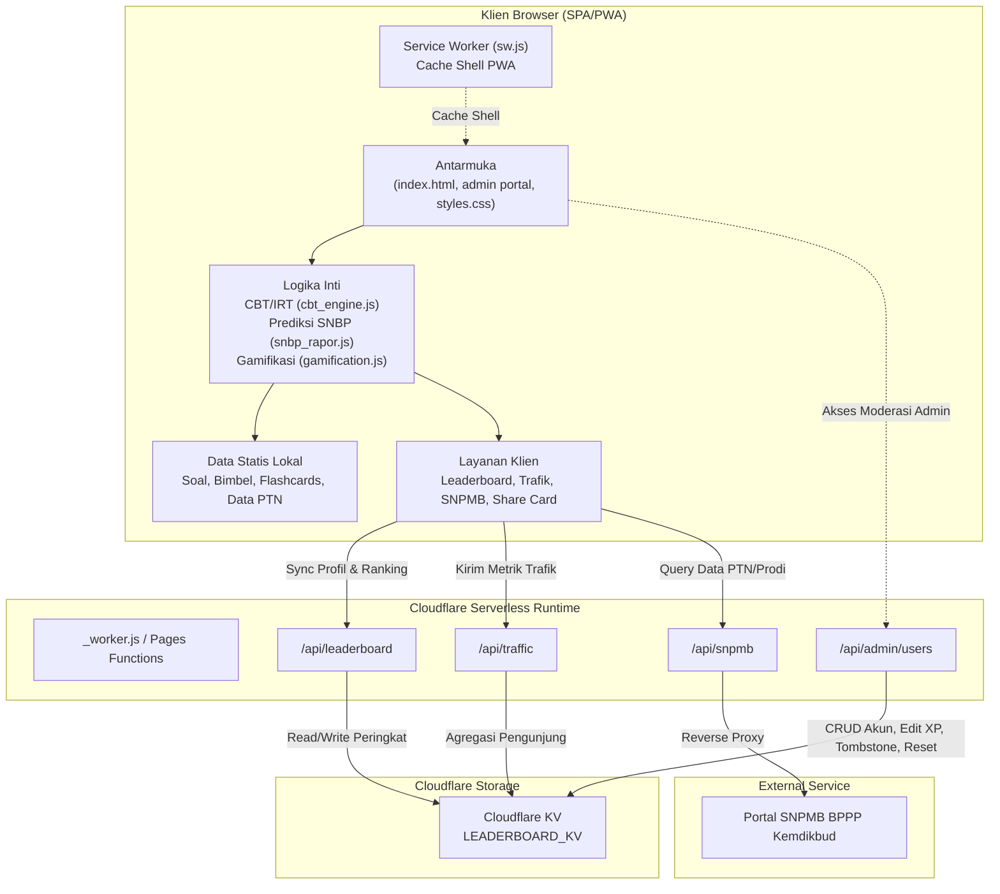
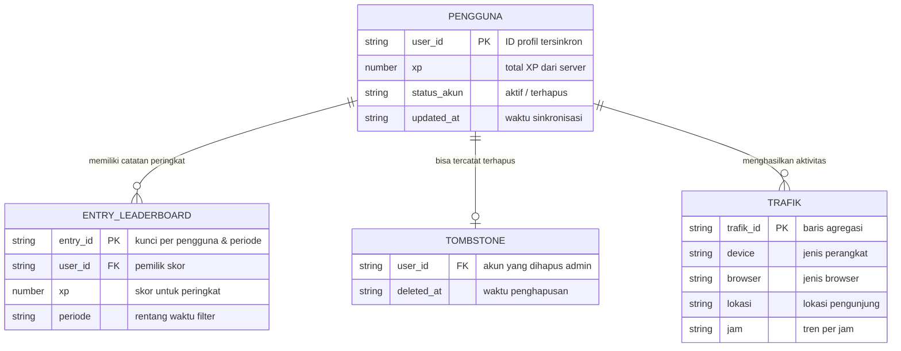

# PRD — Project Requirements Document

## 1. Overview

`tembusptn` adalah platform web persiapan seleksi masuk perguruan tinggi negeri (SNPMB: SNBT dan SNBP) yang berjalan sebagai aplikasi web *Single Page Application* (SPA) sekaligus *Progressive Web App* (PWA). Platform menyatukan berbagai kebutuhan calon mahasiswa dalam satu aplikasi: simulasi ujian berbasis komputer (CBT) ala UTBK, kalkulator prediksi kelulusan SNBP, pusat belajar berisi bank soal dan *flashcard*, hingga data eksplorasi daya tampung perguruan tinggi negeri.

Masalah utama yang diselesaikan:
- Calon peserta SNBT kesulitan berlatih soal dengan suasana ujian berbatas waktu dan penilaian yang mendekati sistem resmi.
- Calon peserta SNBP sulit memperkirakan peluang diterima berdasarkan kondisi nyata nilai rapor, akreditasi sekolah, dan prestasi yang dimiliki.
- Informasi daya tampung, kuota jalur, dan *passing grade* tersebar dan sulit dibandingkan antar program studi.
- Motivasi belajar jangka panjang rendah; pengguna membutuhkan penguatan berupa XP, *streak*, lencana, dan peringkat nasional.
- Pemilik aplikasi memerlukan portal untuk memoderasi pengguna, memantau trafik, dan menjaga kesehatan data.

Tujuan utama aplikasi adalah menjadi pendamping belajar resmi-sekunder bagi calon mahasiswa yang menempuh jalur SNBT maupun SNBP, dengan dukungan data statis lokal agar tetap berfungsi saat *offline*, serta layanan *cloud* ringan untuk papan peringkat, trafik, dan moderasi admin.

## 2. Requirements

Persyaratan utama proyek berdasarkan kondisi aplikasi yang sudah terbangun:

**Fungsional**
- Menyediakan simulasi ujian UTBK per subtes dengan batas waktu, penanda soal ragu, penguncian jawaban, penilaian berbasis *Item Response Theory* (IRT), dan pembahasan.
- Menyediakan kalkulator prediksi SNBP yang memproses nilai rapor semester 1–5, data sekolah, serta sertifikat prestasi untuk menampilkan estimasi peluang diterima.
- Menyediakan pusat belajar mandiri: bank soal, paket soal bimbel, *flashcard*, dan riwayat belajar.
- Menyediakan eksplorasi dan perbandingan data PTN/program studi: daya tampung, kuota SNBP/SNBT, dan *passing grade*.
- Menerapkan gamifikasi: multi-profil, XP, level, *streak*, dan lencana.
- Menyediakan papan peringkat nasional yang tersinkronisasi ke cloud beserta filter periode.
- Memungkinkan pengguna membuat kartu skor ujian berformat potret untuk dibagikan ke media sosial.
- Menyediakan portal admin untuk pemantauan trafik, daftar pengguna, ubah XP, hapus akun, dan reset data.

**Teknis & Non-Fungsional**
- Berjalan sebagai SPA berbasis file statis dan PWA dengan *Service Worker* agar *shell* aplikasi dapat di-cache dan tersedia saat koneksi buruk.
- Sisi klien tetap dapat dipakai untuk latihan soal dan perhitungan karena data soal, *flashcard*, dan katalog PTN disimpan lokal.
- Komunikasi jaringan memakai runtime serverless Cloudflare di *edge* melalui Cloudflare Pages Functions.
- Penyimpanan terpusat memakai Cloudflare KV dengan binding bernama `LEADERBOARD_KV`.
- Akses admin dilindungi verifikasi hak akses; operasi sensitif seperti edit XP, hapus akun, dan reset data divalidasi di sisi server.
- Semua modul berjalan pada *client browser* dengan dependensi ringan: Canvas API, Service Worker API, dan Web Share API.

## 3. Core Features

Fitur-fitur berikut mencakup seluruh Fase 1 sesuai kerangka roadmap dan telah beroperasi dalam repositori.

### Simulasi UTBK
- **Pilih Subtes:** Pengguna memilih subtes UTBK yang ingin diujikan — Penalaran Umum (PU), Pengetahuan Kuantitatif (PK), Penalaran Matematika (PBM), Literasi Bahasa, dan Penalaran Matematika/PM — sebelum sesi dimulai.
- **Kerjakan Soal:** Soal dikerjakan dalam satu sesi ala ujian komputer berbatas waktu; pengguna dapat menandai soal yang masih ragu untuk ditinjau ulang.
- **Kunci Jawaban:** Jawaban otomatis dikunci ketika sesi ujian berakhir dan siap dinilai.
- **Skor & Pembahasan:** Setelah ujian selesai, sistem menampilkan skor akhir berbasis IRT beserta pembahasan tiap soal.

### Prediksi SNBP
- **Isi Nilai Rapor:** Pengguna memasukkan nilai rapor semester 1 hingga 5 sebagai data utama perhitungan.
- **Data Sekolah:** Data akreditasi sekolah dan rekam jejak alumni dilengkapi untuk membuat hasil prediksi lebih sesuai.
- **Tambahkan Prestasi:** Sertifikat dan prestasi penunjang seleksi SNBP dapat dicantumkan sebagai faktor pendukung.
- **Lihat Estimasi:** Aplikasi menampilkan estimasi peluang keterima pada program studi pilihan berdasarkan seluruh data tersebut.

### Pusat Belajar
- **Bank Soal:** Kumpulan soal latihan dari data soal yang tersimpan di aplikasi.
- **Paket Bimbel:** Paket soal bimbel tambahan dengan topik berbeda dari bank soal utama.
- **Flashcard:** Kartu belajar berisi inti materi dan jawaban singkat untuk pengulangan cepat.
- **Riwayat Belajar:** Progres dan latihan yang pernah dikerjakan dapat dilihat kembali.

### Jelajah Kampus
- **Cari PTN/Prodi:** Pencarian universitas atau program studi dari katalog data PTN.
- **Bandingkan Daya Tampung:** Membandingkan daya tampung dan kuota antar program studi.
- **Lihat Kuota Jalur:** Menampilkan kuota jalur SNBP dan SNBT untuk tiap program studi.
- **Cek Passing Grade:** Menampilkan *passing grade* sebagai gambaran ketatnya persaingan suatu prodi.

### Profil Gamifikasi
- **Atur Profil:** Pengguna dapat membuat dan menyimpan lebih dari satu profil belajar pada perangkat yang sama.
- **Kumpulkan XP:** Setiap aktivitas belajar menambah XP dan dapat menaikkan level.
- **Pertahankan Streak:** Hari belajar beruntun dicatat agar pengguna konsisten.
- **Raih Lencana:** Lencana pencapaian terbuka setelah syarat tertentu terpenuhi.

### Papan Peringkat
- **Sinkronkan ke Cloud:** Profil dan XP pengguna dikirim ke cloud agar terhitung dalam papan peringkat.
- **Lihat Peringkat:** Peringkat nasional ditampilkan secara langsung.
- **Filter Periode:** Papan peringkat dapat disaring berdasarkan rentang waktu tertentu.
- **Patuhi Status Akun:** Profil lokal selalu diselaraskan dengan keputusan server, termasuk saat akun dihapus oleh admin.

### Bagikan Skor
- **Hasilkan Kartu Skor:** Gambar kartu skor potret (ukuran 9:16) dirender dari hasil ujian pengguna melalui HTML5 Canvas.
- **Bagikan ke Media Sosial:** Kartu dapat dikirim lewat menu bagikan perangkat, story Instagram, atau status WhatsApp.

### Portal Admin
- **Akses Khusus Admin:** Admin dapat memasuki portal melalui halaman khusus yang dilindungi otorisasi tingkat admin.
- **Pantau Trafik:** Melihat agregasi pengunjung berdasarkan perangkat, browser, lokasi, dan tren per jam.
- **Kelola Pengguna:** Melihat daftar akun dan menghapus akun yang tidak diinginkan.
- **Ubah XP Pengguna:** Memberi atau mengurangi XP akun langsung dari portal.
- **Reset Data:** Mengosongkan seluruh data pengguna yang tersimpan di cloud.

## 4. User Flow

### 1. Alur Simulasi UTBK
1. Pengguna membuka aplikasi dan memilih menu **Simulasi UTBK**.
2. Pengguna memilih subtes yang ingin diujikan.
3. Mesin CBT/IRT memulai sesi; soal ditampilkan satu per satu dengan penghitung waktu.
4. Pengguna menjawab soal dan dapat menandai soal yang masih ragu.
5. Saat waktu habis atau sesi diakhiri, jawaban dikunci.
6. Sistem menilai otomatis dengan IRT lalu menampilkan skor dan pembahasan.
7. Pengguna dapat membuat kartu skor untuk dibagikan.

### 2. Alur Prediksi SNBP
1. Pengguna membuka menu **Prediksi SNBP**.
2. Pengguna memasukkan nilai rapor semester 1–5.
3. Pengguna melengkapi data sekolah (akreditasi dan rekam jejak alumni).
4. Pengguna menambahkan sertifikat prestasi bila ada.
5. Pengguna memilih program studi tujuan.
6. Sistem menghitung dan menampilkan estimasi peluang keterima.

### 3. Alur Pusat Belajar
1. Pengguna membuka **Pusat Belajar**.
2. Pengguna memilih **Bank Soal**, **Paket Bimbel**, atau **Flashcard**.
3. Pengguna mengerjakan soal latihan atau meninjau kartu materi.
4. Hasil dan progres tersimpan di **Riwayat Belajar** dan memengaruhi XP/*streak* profil.

### 4. Alur Jelajah Kampus
1. Pengguna membuka **Jelajah Kampus**.
2. Pengguna mencari PTN atau program studi.
3. Pengguna melihat detail kuota SNBP/SNBT dan *passing grade*.
4. Pengguna dapat membandingkan daya tampung antar program studi pilihan.

### 5. Alur Papan Peringkat & Gamifikasi
1. Pengguna membuat/memilih profil belajar di perangkat.
2. Aktivitas belajar menambah XP, *streak*, level, dan membuka lencana.
3. Pengguna menyinkronkan profil ke cloud.
4. Server memvalidasi data dan mengembalikan keputusan (misal akun aktif/dihapus admin).
5. Pengguna melihat posisinya di papan peringkat nasional dengan filter periode.

### 6. Alur Portal Admin
1. Admin membuka portal khusus dan melewati verifikasi hak akses.
2. Admin melihat daftar akun pengguna dan metrik trafik real-time.
3. Admin dapat mengubah XP, menghapus akun (tercatat sebagai *tombstone*), atau mereset seluruh data cloud.

## 5. Architecture

Aplikasi memakai arsitektur Jamstack tanpa server tradisional: klien berupa web statis yang berjalan sebagai SPA/PWA, sedangkan layanan dinamis dijalankan oleh Cloudflare Pages Functions pada runtime *edge*. Diagram berikut menggambarkan susunan aktual sistem.

Cara kerja sistem:
- **Klien** menangani keseluruhan pengalaman pengguna: tampilan antarmuka, logika simulasi CBT, kalkulator SNBP, gamifikasi, dan penyajian data statis.
- **Service Worker** bertugas meng-cache *shell* aplikasi sehingga pengalaman PWA tetap responsif dan dapat dibuka kembali secara cepat.
- **Cloudflare Pages Functions** menjalankan endpoint API kecil di *edge*: `admin/users`, `leaderboard`, `traffic`, dan `snpmb`.
- **Cloudflare KV** menjadi penyimpanan terpusat untuk data peringkat, profil pengguna, status akun (termasuk *tombstone*), dan agregasi trafik.
- **Portal SNPMB BPPP Kemdikbud** diakses hanya melalui proxy `/api/snpmb` untuk menjaga integritas sumber data PTN/prodi.

## 6. Database Schema

Aplikasi menggunakan dua lapis penyimpanan:

1. **Penyimpanan klien (browser):** LocalStorage/IndexedDB dipakai untuk sesi pengguna, status gamifikasi, dan riwayat pengerjaan; data soal, *flashcard*, dan katalog PTN tersimpan sebagai aset statis JS/JSON.
2. **Penyimpanan server (Cloudflare KV):** Binding `LEADERBOARD_KV` menyimpan catatan peringkat pengguna, status akun, registri akun terhapus (*tombstone*), serta agregasi log trafik.

> Karena Cloudflare KV adalah basis data *key-value*, diagram ER di bawah adalah representasi logis entitas yang tersimpan di dalamnya — bukan skema tabel relasional yang kaku.

### Entitas dan field utama

**1. Pengguna (profil cloud)** — merepresentasikan profil yang disinkronkan ke cloud untuk peringkat.
- `user_id`: ID unik pengguna.
- `xp`: jumlah XP yang disetujui server.
- `status_akun`: status akun; berkaitan dengan keputusan admin, termasuk penghapusan.
- `updated_at`: waktu sinkronisasi/pembaruan terakhir.

**2. Entri Peringkat (leaderboard)** — menyimpan data peringkat nasional yang dapat difilter.
- `entry_id`: kunci catatan peringkat per pengguna/periode.
- `user_id`: referensi pemilik catatan.
- `xp`: skor yang dipakai untuk urutan peringkat.
- `periode`: rentang waktu (misal mingguan/bulanan) untuk filter.

**3. Tombstone Registry** — mencegah kebangkitan data pengguna yang telah dihapus admin.
- `user_id`: akun yang dihapus.
- `deleted_at`: waktu pencatatan penghapusan.

**4. Trafik** — agregasi log pengunjung.
- `trafik_id`: kunci agregasi.
- `device`: kategori perangkat pengunjung.
- `browser`: jenis browser pengunjung.
- `lokasi`: lokasi geografis pengunjung.
- `jam`: pola/tren kunjungan per jam.

**5. Penyimpanan lokal klien (non-server)** — menyimpan profil gamifikasi dan riwayat kegiatan belajar agar fitur tetap bekerja offline. Field utamanya mencakup identitas profil, XP, level, *streak*, lencana, dan riwayat pengerjaan.

## 7. Tech Stack

Tech stack yang digunakan adalah teknologi yang benar-benar terbaca dari codebase repositori, bukan default umum:

- **Frontend / PWA:** HTML5 + CSS (`styles.css`) + JavaScript vanilla sebagai SPA/PWA — tanpa framework UI besar. Berkas inti: `app.js`, `cbt_engine.js`, `snbp_rapor.js`, `gamification.js`, serta modul layanan `cloud_leaderboard.js`, `snpmb_service.js`, `traffic_tracker.js`, `analytics.js`, dan `share_card.js`.
- **Progressive Web App:** Service Worker (`sw.js`) dan Web App Manifest untuk caching shell offline.
- **Data Statis Klien:** JavaScript dan JSON (`questions.js`, `bimbel_questions.js`, `flashcards.js`, `ptn_data.js`, `snpmb_ptn.json`).
- **Backend / Edge Runtime:** Cloudflare Pages Functions / Cloudflare Workers (`_worker.js`, direktori `functions/api/`) dengan endpoint `/api/admin/users`, `/api/leaderboard`, `/api/traffic`, dan `/api/snpmb`.
- **Database / Penyimpanan:** Cloudflare KV dengan binding `LEADERBOARD_KV`, plus LocalStorage/IndexedDB di sisi browser.
- **Deployment & Konfigurasi:** Cloudflare Pages; `wrangler.toml` untuk konfigurasi runtime dan binding KV; `vercel.json` menyediakan aturan *rewrite* bila aplikasi dideploy di atas infrastruktur Vercel.
- **Web API pendukung:** HTML5 Canvas (kartu skor), Web Share API (berbagi ke media sosial), dan pustaka rendering rumus matematika KaTeX/MathJax.